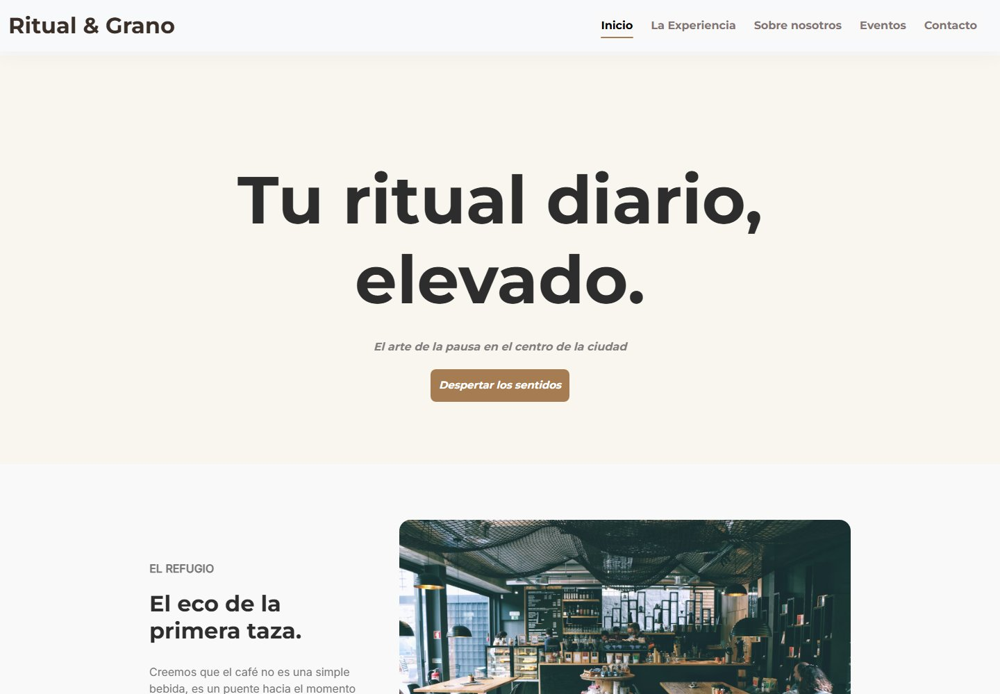
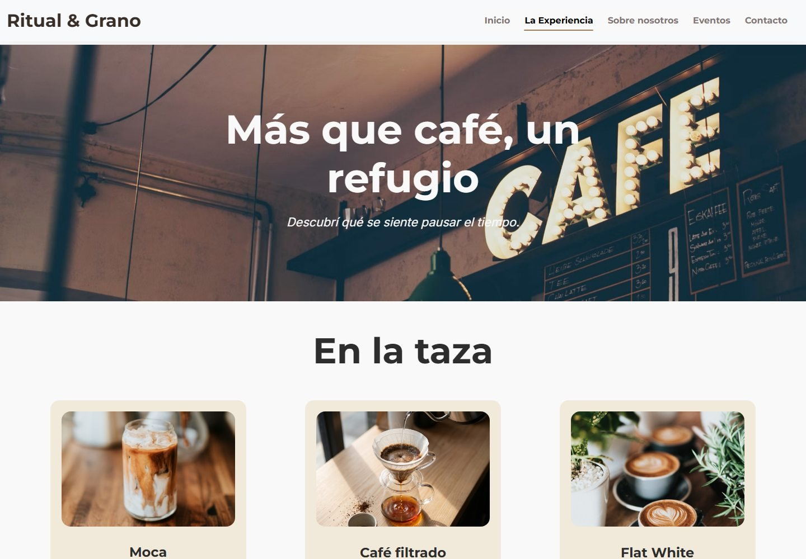
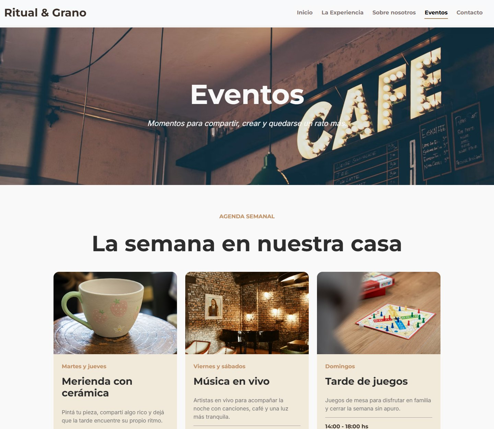
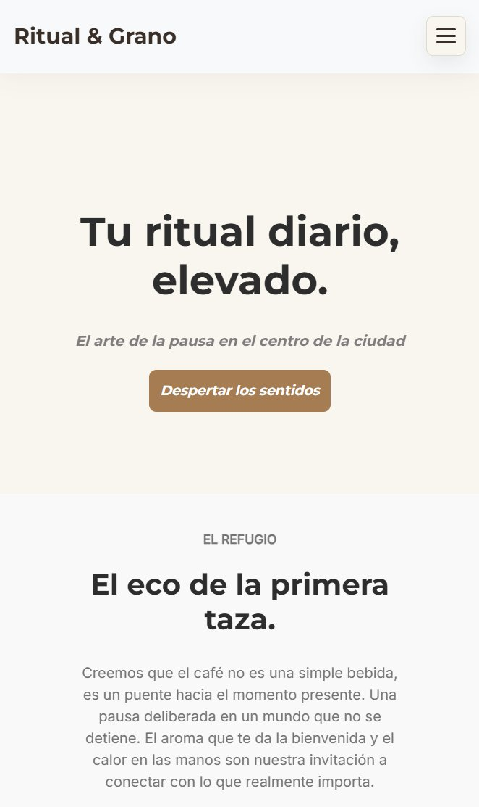
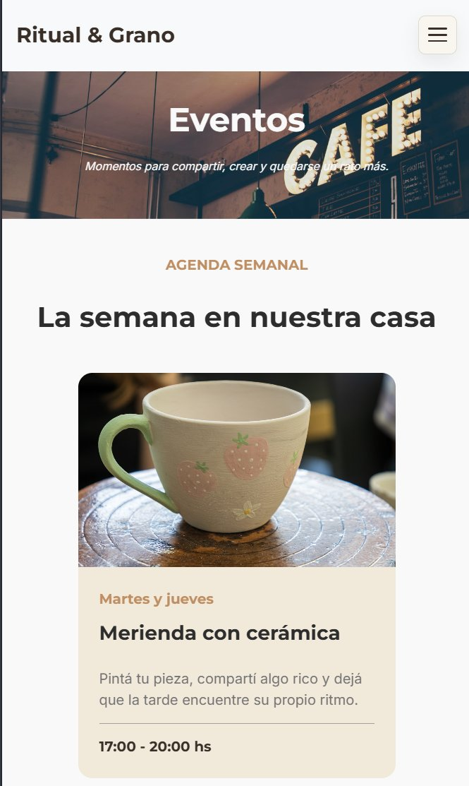
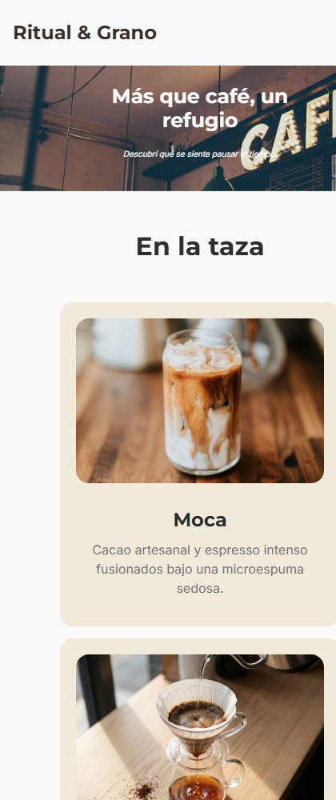

# Ritual & Grano

Sitio web responsive para una cafetería premium, desarrollado como proyecto integral de desarrollo web.

## Demo

[Ver sitio publicado](https://ritual-grano.vercel.app)

## Capturas

### Escritorio

<table>
  <tr>
    <td align="center"><strong>Inicio</strong> </td>
    <td align="center"><strong>La experiencia</strong> </td>
    <td align="center"><strong>Eventos</strong> </td>
  </tr>
</table>

### Móvil

<table>
  <tr>
    <td align="center"><strong>Inicio</strong> </td>
    <td align="center"><strong>Eventos</strong> </td>
  </tr>
</table>

  
<strong>La experiencia y carta de cafés (móvil)</strong>

  

## Descripción

Ritual & Grano es una landing page para una cafetería premium. El objetivo fue crear una experiencia visual cálida, moderna y adaptable a distintos dispositivos.

El proyecto incluye una navegación clara, secciones informativas, presentación de productos y una identidad visual coherente con la temática gastronómica.

## Tecnologías utilizadas

- HTML5
- CSS3
- SCSS
- Bootstrap
- Animate.css
- AOS
- Git y GitHub
- Vercel

## Características

- Diseño responsive para computadora, tablet y celular.
- Maquetación semántica con HTML.
- Estilos organizados con CSS y SCSS.
- Componentes y navegación con Bootstrap.
- Animaciones de entrada y desplazamiento.
- Código versionado mediante Git y publicado en GitHub.
- Deploy realizado en Vercel.

## Aprendizajes

Durante el desarrollo practiqué la organización de una página web completa, la adaptación responsive, el uso de SCSS, la integración de librerías externas, la jerarquía visual y el flujo de trabajo con Git, GitHub y Vercel.

## Ejecución local

1. Clonar el repositorio: git clone https://github.com/lautiimc/Ritual-Grano.git
2. Abrir la carpeta del proyecto.
3. Ejecutar index.html con un navegador o mediante Live Server.

## Autor

Lautaro Nicolás Romero

- [GitHub](https://github.com/lautiimc)
- [LinkedIn](https://www.linkedin.com/in/lautaro-romero-lr)
